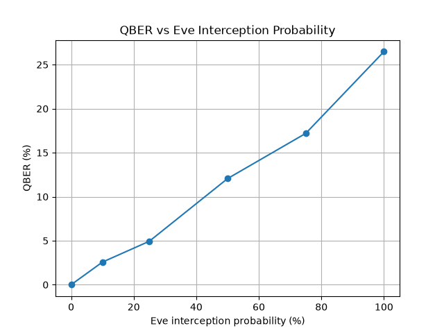
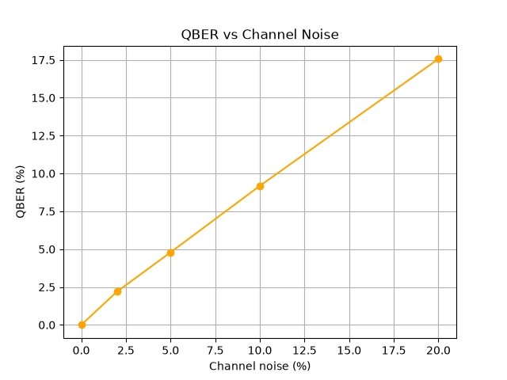
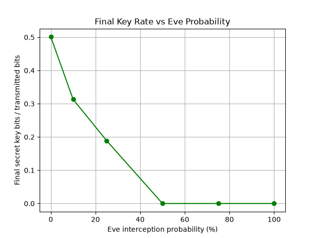

# EntangleNet

## Problem
In an era where large-scale quantum computers threaten classical public-key cryptography, we need new methods of securing communications.

## Why BB84
BB84 QKD derives its security from the fundamental principles of quantum mechanics. Specifically, measuring an unknown quantum state introduces a disturbance. Eavesdropping (by Eve) inevitably causes errors (QBER), allowing Alice and Bob to detect her presence.

## Mathematical formulation
- **QBER equation**: $QBER = \frac{N_{mismatches}}{N_{compared}}$
- **Basis selection**: 0 for Z basis, 1 for X basis.
- **State preparation**: 
  - Z basis: bit 0 -> $|0\rangle$, bit 1 -> $|1\rangle$
  - X basis: bit 0 -> $|+\rangle$, bit 1 -> $|-\rangle$
- **Measurement concept**: If Bob measures in the same basis Alice prepared the state in, he gets a deterministic outcome (absent noise). If he measures in the wrong basis, he gets a random outcome.

## Architecture
- Alice: Generates random bits and bases, encodes into quantum circuits.
- Quantum Channel: Transmits circuits. Can introduce noise.
- Eve: Intercept-resend attack. She measures a fraction of qubits and resends them, causing disturbance.
- Bob: Measures received qubits in random bases.
- Sifting: Alice and Bob discard bits where their bases don't match.
- QBER: Calculate the error rate on a sample of the sifted key.
- Error Correction: Simplified perfect correction with calculated leakage based on $1.2 \cdot h(QBER)$.
- Privacy Amplification: Toeplitz hashing reduces the key length by the estimated amount of Eve's information.

## Classical vs PQC vs QKD
- **Classical public-key cryptography**: Security based primarily on computational assumptions (e.g. RSA, ECC).
- **Post-quantum cryptography (PQC)**: Classical algorithms designed to resist known quantum attacks.
- **BB84 QKD**: Security mechanism based on quantum-state disturbance. 
*Note: BB84 does NOT make classical/PQC cryptography obsolete. QKD and PQC can be complementary technologies.*

## Installation
```bash
python -m venv .venv
source .venv/bin/activate
pip install -r requirements.txt
```

## Running
### Dashboard
```bash
cd app
streamlit run app.py
```

### Jupyter Notebooks
Run the notebooks in `notebooks/` using Jupyter:
```bash
jupyter notebook notebooks/
```

### Experiment Runner
You can run the experiment notebooks to generate the results in the `results/` folder.

## Results




## Limitations
- Simulator rather than production optical QKD.
- Simplified error correction (not true Cascade).
- Simplified security decision threshold.
- No finite-key effects considered rigorously.
- No full composable security proof.
- No physical optical channel.
- No device-independent security guarantee.

## Future work
- IBM Quantum hardware validation
- Decoy-state BB84
- Finite-key security analysis
- Authenticated classical channel
- Optical QKD
- QKD + PQC hybrid deployment
- Hardware noise characterization
